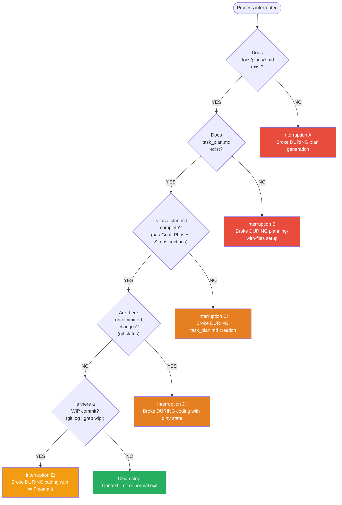
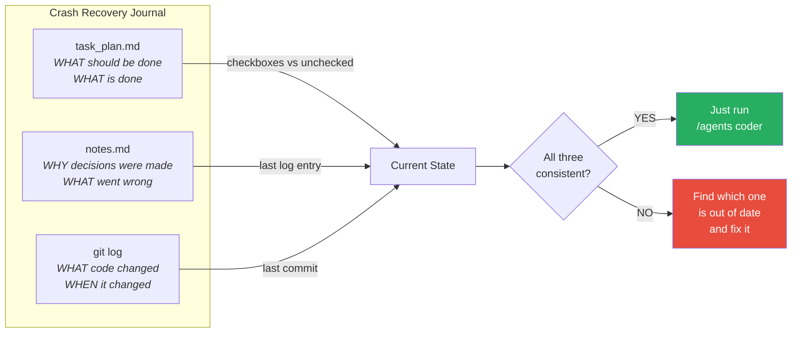

# Root Cause Analysis Guide — Long-Running Agent Plugin

When the agent process gets interrupted, use this guide to diagnose what happened and recover cleanly.

---

## Quick Diagnostic: The 5-Item Checklist

Run these immediately after an interruption:

| # | What | Command | Why |
|---|---|---|---|
| 1 | **Claude's last output** | Copy last 50-100 lines from session | Shows exact error, tool failure, or context-limit warning |
| 2 | **Git state** | `git status && git diff --stat` | Reveals dirty state, partially written files, uncommitted changes |
| 3 | **task_plan.md status** | `grep -A5 "## Status" task_plan.md` | Shows what the agent thought it was doing |
| 4 | **notes.md last entry** | `tail -20 notes.md` | Shows last logged action/decision/error |
| 5 | **File existence** | `ls task_plan.md notes.md init.sh docs/plans/*.md 2>&1` | Shows how far the initializer/coder got |

---

## Interruption Point Diagnosis



---

## Detailed RCA by Interruption Point

### Interruption A: Broke during plan generation

**Symptom:** `docs/plans/*.md` does not exist or is incomplete.

**What was happening:** The Initializer Agent was in Phase 2 (Brainstorming) or Phase 3 (Writing Plan) when it died.

**Collect:**

```bash
# Was brainstorming completed? Check for partial plan files
find docs/plans -name "*.md" 2>/dev/null

# Check if any plan file exists but is incomplete
if ls docs/plans/*.md 2>/dev/null; then
  echo "=== Plan file last 10 lines ==="
  tail -10 docs/plans/*.md
  echo "=== Plan file line count ==="
  wc -l docs/plans/*.md
fi

# Git state
git status
git log --oneline -5
```

**Root causes:**
| Cause | Evidence | Fix |
|---|---|---|
| Context window exhausted during brainstorming | Claude output shows long Q&A, then silence | Re-run `/agents initializer` with a more concise spec |
| Tool error during file write | Claude output shows Write/Edit tool failure | Check disk space, permissions; re-run |
| User disconnected mid-session | No error in output, just stops | Re-run `/agents initializer` |
| Plan file partially written | File exists but truncated (no closing sections) | Delete partial file, re-run initializer |

**Recovery:**

```bash
# Option 1: Clean restart (recommended if plan is missing/broken)
rm -f docs/plans/*.md
# Then re-run: /agents initializer

# Option 2: If plan exists and looks complete, skip to file setup
# Tell initializer: "The plan already exists at docs/plans/[filename].md.
# Skip brainstorming and planning. Start from Phase 4: Setup Progress Tracking."
```

---

### Interruption B: Broke during planning-with-files setup

**Symptom:** `docs/plans/*.md` exists and is complete, but `task_plan.md` and/or `notes.md` are missing.

**What was happening:** The Initializer Agent completed the plan but died during Phase 4 (creating task_plan.md / notes.md).

**Collect:**

```bash
# Does the plan look complete?
echo "=== Plan task count ==="
grep -c "^### Task" docs/plans/*.md

# What planning files exist?
ls -la task_plan.md notes.md init.sh 2>&1

# Git state
git status
git log --oneline -5
```

**Root causes:**
| Cause | Evidence | Fix |
|---|---|---|
| Context limit hit after big plan generation | Plan file is very large (200+ lines) | Re-run initializer, tell it plan exists |
| planning-with-files skill not installed | Error about missing skill in Claude output | Install the skill, re-run |
| File permission error | Write tool error in output | Check directory permissions |

**Recovery:**

```bash
# The plan is the hard part — it's already done.
# Tell the initializer to pick up from Phase 4:
# "The implementation plan already exists at docs/plans/[filename].md.
#  Please create task_plan.md and notes.md from it, then continue
#  with Phase 5 (init.sh) and Phase 6 (git commit)."
```

---

### Interruption C: Broke during task_plan.md creation (partial file)

**Symptom:** `task_plan.md` exists but is incomplete (missing sections).

**Collect:**

```bash
# Check which sections exist
echo "=== Sections in task_plan.md ==="
grep "^## " task_plan.md

# Required sections: Goal, Phases, Key Questions, Decisions Made, Errors Encountered, Status
for section in "Goal" "Phases" "Key Questions" "Decisions Made" "Errors Encountered" "Status"; do
  if grep -q "## $section" task_plan.md; then
    echo "✓ $section"
  else
    echo "✗ MISSING: $section"
  fi
done

# Count checkboxes
echo "=== Checkbox count ==="
echo "Unchecked: $(grep -c '\- \[ \]' task_plan.md)"
echo "Checked:   $(grep -c '\- \[x\]' task_plan.md)"

# Compare to plan task count
echo "Plan tasks: $(grep -c '^### Task' docs/plans/*.md)"
```

**Root causes:**
| Cause | Evidence | Fix |
|---|---|---|
| Context limit during file creation | task_plan.md has fewer checkboxes than plan has tasks | Complete the missing sections manually or re-run |
| Edit tool collision | Garbled content in task_plan.md | Delete and re-create |

**Recovery:**

```bash
# If task_plan.md is mostly complete (just missing a section or two)
# Tell the coder/initializer what's missing:
# "task_plan.md is missing the [section] section. Please add it."

# If task_plan.md is severely broken
rm task_plan.md notes.md
# Re-run initializer, tell it: "Plan exists, recreate planning files only."
```

---

### Interruption D: Coder broke mid-task with uncommitted changes

**Symptom:** `git status` shows modified/untracked files. No WIP commit.

**This is the most dangerous state** — partially implemented code may be inconsistent.

**Collect:**

```bash
# What files are dirty?
echo "=== Uncommitted changes ==="
git status --short

# How much changed?
echo "=== Change summary ==="
git diff --stat

# What was the agent working on?
echo "=== task_plan.md Status ==="
grep -A5 "## Status" task_plan.md

# What does notes.md say?
echo "=== Last log entry ==="
tail -20 notes.md

# Do tests pass?
echo "=== Test results ==="
# (run project-specific test command, e.g. npm test, pytest, etc.)

# What task was in progress?
echo "=== Last completed task ==="
grep "\[x\]" task_plan.md | tail -1
echo "=== Next unchecked task ==="
grep "\[ \]" task_plan.md | head -1
```

**Root causes:**
| Cause | Evidence | Fix |
|---|---|---|
| Context limit mid-implementation | Claude output mentions context/token limit | Stash or commit WIP, re-run coder |
| Tool error during Edit/Write | Claude output shows tool failure | Inspect dirty files, fix or revert |
| Test failure caused a spiral | Multiple test errors in output, agent gave up | Revert to last clean commit |
| Network disconnection | Session ended abruptly, no error | Inspect changes, decide keep or revert |

**Recovery decision tree:**

```bash
# Step 1: Do the tests pass with current changes?
# (run test command)

# If tests PASS:
git add -A
git commit -m "wip: partial work from interrupted session"
# Then run /agents coder — it will continue from here

# If tests FAIL:
# Option A: Revert everything
git checkout .
git clean -fd
# Then run /agents coder — it restarts the task

# Option B: Stash for later inspection
git stash save "interrupted-session-$(date +%Y%m%d-%H%M)"
# Then run /agents coder
```

---

### Interruption E: Coder broke mid-task with WIP commit

**Symptom:** `git log` shows a `wip:` commit. Working directory is clean.

**This is the designed graceful-stop state.** The coder agent's "When Context is Running Low" logic created the WIP commit.

**Collect:**

```bash
echo "=== WIP commit ==="
git log --oneline -3

echo "=== task_plan.md Status ==="
grep -A5 "## Status" task_plan.md

echo "=== notes.md last entry ==="
tail -15 notes.md
```

**Root cause:** Almost always context limit — this is normal behavior, not an error.

**Recovery:**

```bash
# Just re-run the coder. session-start will:
# 1. Read task_plan.md (sees "Stopped mid-session. Next: [task]")
# 2. Read notes.md (sees what was learned)
# 3. Check git log (sees WIP commit)
# 4. Pick up where it left off

# Run: /agents coder
```

---

### Clean Stop (Interruption F)

**Symptom:** No uncommitted changes, no WIP commits, task_plan.md Status is up-to-date.

**This is not a failure.** Either the context limit was hit cleanly or the agent completed its work for the session.

**Recovery:** Just run `/agents coder` again.

---

## Common Failure Patterns

### Pattern 1: Repeated interruption at the same point

**Symptom:** Agent keeps dying at the same task across multiple sessions.

**RCA steps:**
```bash
# Check if a specific task is too large
grep -A10 "### Task [N]" docs/plans/*.md | wc -l

# Check error log
grep -A2 "Errors Encountered" task_plan.md

# Check if the task has undeclared dependencies
# (look at task description for references to files that don't exist yet)
```

**Root cause:** Task is too large for one context window, or has a blocking dependency.

**Fix:** Split the task into smaller sub-tasks in `docs/plans/*.md` and add corresponding checkboxes to `task_plan.md`.

### Pattern 2: Initializer keeps restarting from scratch

**Symptom:** Running `/agents initializer` again regenerates the plan instead of continuing.

**RCA steps:**
```bash
# Does the plan file exist?
ls docs/plans/*.md

# Is it referenced correctly?
cat task_plan.md | head -5
```

**Root cause:** Initializer doesn't detect existing artifacts.

**Fix:** Tell the initializer explicitly:

```
The plan already exists at docs/plans/[filename].md and task_plan.md
is set up. Skip to Phase 5 (init.sh) or Phase 7 (report).
```

### Pattern 3: Progress tracking drift

**Symptom:** `task_plan.md` checkboxes don't match actual git commits.

**RCA steps:**
```bash
# Compare checked tasks vs feat: commits
echo "=== Checked tasks ==="
grep "\[x\]" task_plan.md | wc -l

echo "=== Feature commits ==="
git log --oneline | grep "^.*feat:" | wc -l

# Find the drift
echo "=== Last checked task ==="
grep "\[x\]" task_plan.md | tail -1

echo "=== Last feature commit ==="
git log --oneline | grep "feat:" | head -1
```

**Root cause:** Agent completed code + commit but died before updating task_plan.md.

**Fix:** Manually mark the completed task as `[x]` in `task_plan.md`, then run `/agents coder`.

---

## Crash Recovery Journal

The plugin's three files form a crash-recovery journal:



**Consistency check:**

```bash
echo "=== Consistency Check ==="

# Last completed task (from task_plan.md)
echo "task_plan.md last [x]:"
grep "\[x\]" task_plan.md | tail -1

# Last progress log (from notes.md)
echo "notes.md last completion:"
grep "Completed:" notes.md | tail -1

# Last feature commit (from git)
echo "git last feat commit:"
git log --oneline | grep "feat:" | head -1

echo ""
echo "If all three reference the same task → consistent → just re-run coder"
echo "If they disagree → find which is behind and update it manually"
```

---

## Prevention: Reducing Interruption Impact

1. **Keep tasks small** — each task in `docs/plans/*.md` should be completable in ~50 tool calls
2. **Commit frequently** — the coder agent commits after every task, not at session end
3. **Log eagerly** — notes.md entries are cheap, missing context is expensive
4. **Monitor context usage** — if Claude mentions "context is getting long", expect a stop soon
5. **Use `maxTurns: 100`** — the coder agent has this set to prevent runaway sessions
