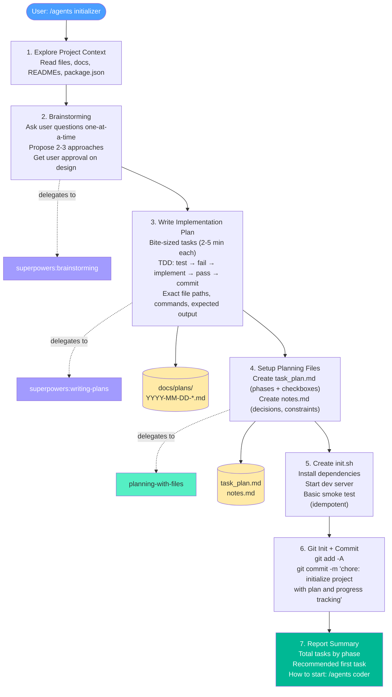
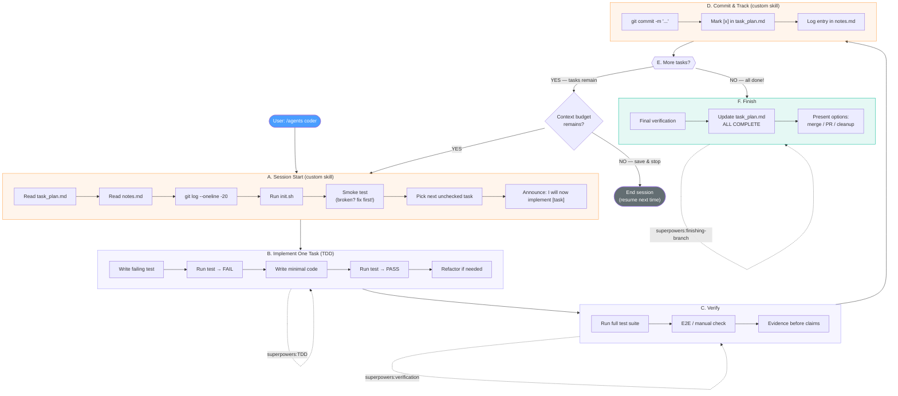
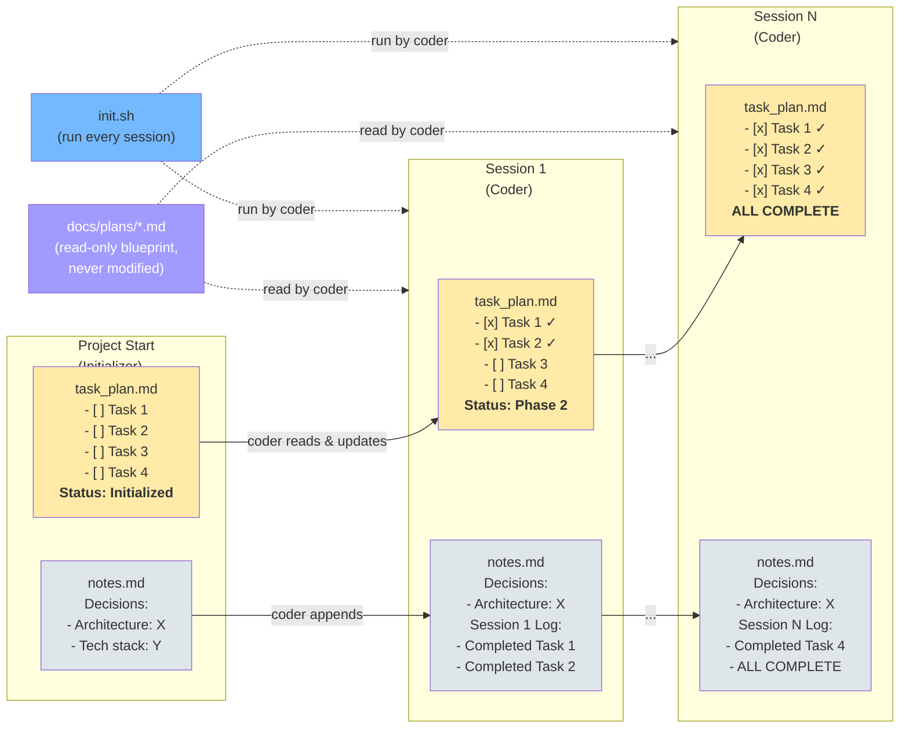
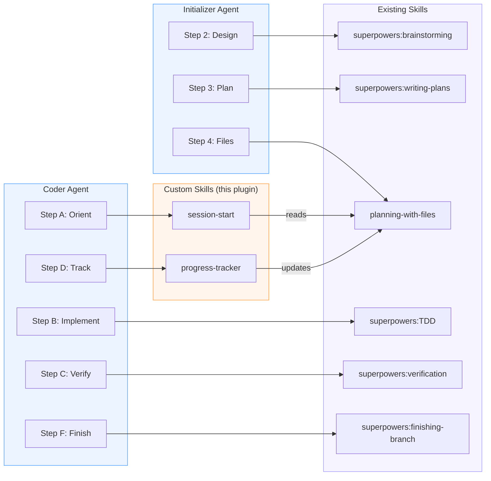
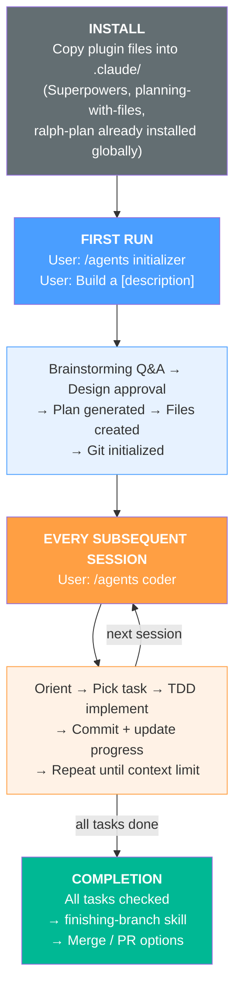

# Long-Running Agent Plugin — Design Document

> **For Claude:** REQUIRED SUB-SKILL: Use superpowers:executing-plans to implement this plan task-by-task.

**Goal:** A reusable Claude Code plugin that gives any project long-running agent capabilities via two orchestrating Subagents + two custom Skills, delegating to existing Superpowers / Planning-with-Files / Ralph-plan skills.

**Architecture:** Hybrid — custom Subagents own orchestration logic, existing skills do the heavy lifting.

**Dependencies:** Superpowers plugin, Planning with Files skill, Ralph-plan skill (all assumed installed).

---

## 1. Overall Architecture

```mermaid
graph TB
    subgraph Project["User's Project"]
        CLAUDE_MD[".claude/CLAUDE.md<br/>(project conventions)"]

        subgraph Agents["Subagents (this plugin)"]
            INIT["initializer.md<br/>(run ONCE)"]
            CODER["coder.md<br/>(run EVERY session)"]
        end

        subgraph CustomSkills["Custom Skills (this plugin)"]
            SS["session-start/SKILL.md"]
            PT["progress-tracker/SKILL.md"]
        end

        subgraph Files["Files on Disk (working memory)"]
            TP["task_plan.md"]
            NOTES["notes.md"]
            PLAN["docs/plans/YYYY-MM-DD-*.md"]
            INITSH["init.sh"]
        end
    end

    subgraph Existing["Pre-installed Skills (NOT part of plugin)"]
        subgraph SP["Superpowers"]
            BRAIN["brainstorming"]
            WP["writing-plans"]
            EP["executing-plans"]
            SDD["subagent-driven-dev"]
            TDD["TDD"]
            VERIF["verification"]
            FINISH["finishing-branch"]
        end
        PWF["planning-with-files"]
        RP["ralph-plan"]
    end

    INIT -->|delegates design| BRAIN
    INIT -->|delegates planning| WP
    INIT -->|delegates file setup| PWF
    CODER --> SS
    CODER -->|delegates implementation| TDD
    CODER -->|delegates verification| VERIF
    CODER --> PT
    CODER -->|delegates completion| FINISH
    SS -->|reads| TP
    SS -->|reads| NOTES
    PT -->|updates| TP
    PT -->|appends| NOTES
    PWF -->|manages| TP
    PWF -->|manages| NOTES
    WP -->|generates| PLAN

    style INIT fill:#4a9eff,color:#fff
    style CODER fill:#4a9eff,color:#fff
    style SS fill:#ff9f43,color:#fff
    style PT fill:#ff9f43,color:#fff
    style BRAIN fill:#a29bfe,color:#fff
    style WP fill:#a29bfe,color:#fff
    style EP fill:#a29bfe,color:#fff
    style SDD fill:#a29bfe,color:#fff
    style TDD fill:#a29bfe,color:#fff
    style VERIF fill:#a29bfe,color:#fff
    style FINISH fill:#a29bfe,color:#fff
    style PWF fill:#55efc4,color:#333
    style RP fill:#55efc4,color:#333
    style TP fill:#ffeaa7,color:#333
    style NOTES fill:#ffeaa7,color:#333
    style PLAN fill:#ffeaa7,color:#333
    style INITSH fill:#ffeaa7,color:#333
```

---

## 2. Initializer Agent Flow (run ONCE per project)

---

## 3. Coder Agent Flow (run EVERY session)

---

## 4. File Lifecycle Across Sessions

---

## 5. Skill Delegation Map

---

## 6. Plugin Deliverables

| File | Type | Purpose |
|---|---|---|
| `.claude/agents/initializer.md` | Subagent | First-run orchestration |
| `.claude/agents/coder.md` | Subagent | Per-session coding loop |
| `.claude/skills/session-start/SKILL.md` | Skill | Session orientation |
| `.claude/skills/progress-tracker/SKILL.md` | Skill | Progress management |
| `.claude/CLAUDE.md` | Config | Project conventions |
| `README.md` | Docs | Installation & usage guide |

---

## 7. User Journey

